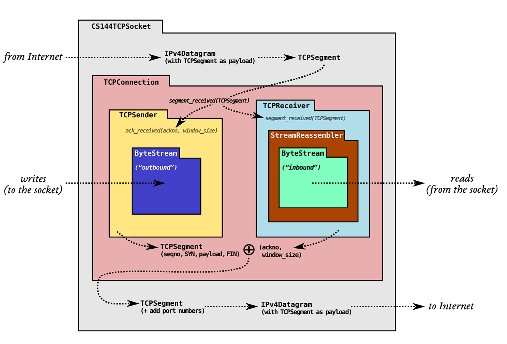
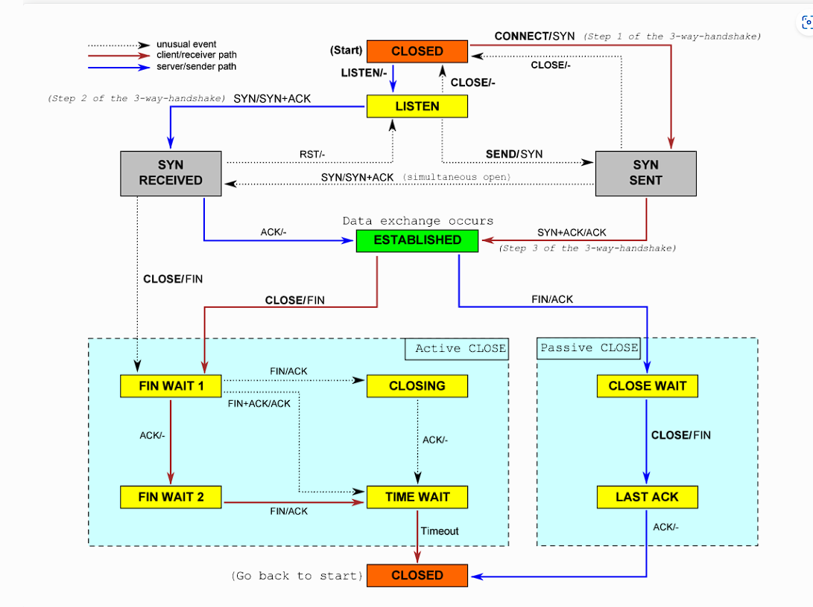
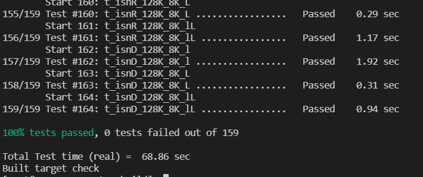
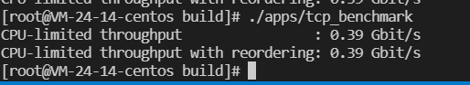

# 【计算机网络】cs144 lab

**为了更好的贯彻手拿TCP脚踩UDP兜里装个ICMP的意愿，遂写一个小lab**

由于再写时官网还没有更新完文档于是用了一个大佬搭的备份19年版本[【计算机网络】Stanford CS144 Lab Assignments 学习笔记 - 康宇PL - 博客园 (cnblogs.com)](https://www.cnblogs.com/kangyupl/p/stanford_cs144_labs.html)

我是在看完中科大的网络就直接写这个了，搭配 计算机网络自顶向下 TCP/IP 详解 卷1，可以适度完成

###### 前言：

本lab实验环境在centos g++ 8 实现 cmake版本12

如果make 报错在tun.cc  可在里面添加头文件

```c++
#include "tun.hh"
#include "util.hh"
//下面这俩个
#include <sys/types.h>
#include <sys/socket.h>
```

需要调试可看lab4里的调试技巧

## LAB0

###### Writing webget

利用提供的API写个GET请求就可以

```c++
void get_URL(const string &host, const string &path) {
    std::unique_ptr<TCPSocket> sock = std::make_unique<TCPSocket>();
    sock->connect(Address(host,"http"));
    std::string mesage  = "GET " + path + " HTTP/1.1\r\n"
                        +"Host: " + host + "\r\n"
                        +"Connection: close \r\n\r\n";
    sock->write(mesage);
    sock->shutdown(SHUT_WR);
    while(!sock->eof())
    {
        cout<<sock->read();
    }
    cerr << "Function called: get_URL(" << host << ", " << path << ").\n";
    cerr << "Warning: get_URL() has not been implemented yet.\n";
}
// ps  如果出现 t_webget (Failed)错误 修改tests/webget_t.sh 权限 +x
```

###### An in-memory reliable byte stream

要求实现一个有序字节流类（in-order byte stream），使之支持读写、容量控制。这个字节流类似于一个带容量的队列，从一头读，从另一头写。当流中的数据达到容量上限时，便无法再写入新的数据。特别的，写操作被分为了peek和pop两步。peek为从头部开始读取指定数量的字节，pop为弹出指定数量的字节。英语不好一开始还真看不太懂eof是干嘛用的

```c++
//.hh	
	size_t _capacity; 
    std::deque<char> _data {};
    size_t _bytes_Wrlen = 0 ;
    size_t _bytes_Poplen = 0;
    bool _input_signal = false;
    bool _error = false;  //!< Flag indicating that the stream suffered an error.
```

```c++
//.cc
#include "byte_stream.hh"

#include <algorithm>
#include <iterator>
#include <stdexcept>

// Dummy implementation of a flow-controlled in-memory byte stream.

// For Lab 0, please replace with a real implementation that passes the
// automated checks run by `make check_lab0`.

// You will need to add private members to the class declaration in `byte_stream.hh`

template <typename... Targs>
void DUMMY_CODE(Targs &&... /* unused */) {}

using namespace std;

ByteStream::ByteStream(const size_t capacity) :
 _capacity(capacity) {}

size_t ByteStream::write(const string &data1) {
    size_t Len  = remaining_capacity();
    size_t Add_length = Len >= data1.size() ? data1.size() : Len;
    for(size_t i =0 ;i < Add_length ; i++)
    {
        _data.push_back(data1[i]);
    }
    _bytes_Wrlen += Add_length;
    return Add_length;
}

//! \param[in] len bytes will be copied from the output side of the buffer
string ByteStream::peek_output(const size_t len) const {
    size_t Len = _data.size();
    size_t Peek_Length = Len > len ? len : Len;
    return {_data.begin() ,_data.begin() + Peek_Length};
}

//! \param[in] len bytes will be removed from the output side of the buffer
void ByteStream::pop_output(const size_t len) {
    size_t Len = _data.size();
    size_t Peek_Length = Len > len ? len : Len;
    _bytes_Poplen += Peek_Length;
    _data.erase(_data.begin() , _data.begin() + Peek_Length);
}

void ByteStream::end_input() { _input_signal = true;}

bool ByteStream::input_ended() const { return _input_signal; }

size_t ByteStream::buffer_size() const { return _data.size(); }

bool ByteStream::buffer_empty() const { return _data.empty(); }

bool ByteStream::eof() const { return _input_signal && buffer_empty(); }

size_t ByteStream::bytes_written() const { return _bytes_Wrlen; }

size_t ByteStream::bytes_read() const { return _bytes_Poplen; }

size_t ByteStream::remaining_capacity() const {  return _capacity - _data.size(); }

```

## LAB1

本实验要求实现一个流重组器（stream reassembler）， 其中可以 重复， 乱序， 碎片

1 如果已经成功组成一个开头到之后的流片段那么应该立即放入_output中

2 EOF 可能提前到，也可能只是一个EOF空串

3 如果字节流满了同样无法写入，除非字节流被pop出，流重组器满了也一样，后续来的碎片只能被丢弃

根据本题碎片有可能交叉而且重复，且有EOF限制

```
根据上述分析 来的是碎片化的字节流 而且有重复， 就相当于一个一个集合，当集合有交集的时候可以合成一个大集合
不过我打算直接用vector<char> 来存储 因为只有开头流是一个整体就可以存入byte_stream所以维护一个已存入流的下标就可以了，另外就是区分碎片和非碎片，我选用了vector<bool> 来进行辨别（vecotr<bool> 遍历时不用引用修改）, 碎片有交集合并这件事就很简单了，因为本身数组特性就可以去重合并，其中当开头插入一个碎片时还需判断后续碎片是否已经完整，所以记录一个下标判断到不完整即可 而且由于防止byte不能同步写入记录一个下标用于记录写入数量
```

###### stream_reassembler.hh

```c++
 private: 
    ByteStream _output;  //!< The reassembled in-order byte stream
    size_t _capacity ;      //!< The maximum number of bytes
    // Your code here -- add private members as necessary.
    std::vector<char> _assembles {} ; //assembles string by index  if ok -> _output
    std::vector<bool> _set{}; // ture or false exist
    size_t _now_index {}; // assembled bytes index
    size_t _now_assem_byteix {}; //alreday write _output index
    size_t _end_index =  -1;  // eof index 
    size_t _sum_bytes {};
    int _full_flag {}; // 当容器满了但是还eof还没到++
public:
size_t StreamReassembler::residue() const;
uint64_t  StreamReassembler::headno() const ;
```

###### stream_reassembler.cc

```c++
StreamReassembler::StreamReassembler(const size_t capacity) :
                     _output(capacity), _capacity(capacity) {
    _assembles.resize(_capacity);
    _set.resize(_capacity);
    for (auto &i : _assembles)
        i = 0;
    for(auto i : _set)
        i = 0;
}

//! \details This function accepts a substring (aka a segment) of bytes,
//! possibly out-of-order, from the logical stream, and assembles any newly
//! contiguous substrings and writes them into the output stream in order.
void StreamReassembler::push_substring(const string &data, const size_t index, const bool eof) 
{
    size_t offset = _full_flag * _capacity;
    size_t end = data.size() + index;
    if(1 == eof) _end_index = end;
    size_t start = index >  _now_index + offset ? index : _now_index + offset;
    if(end  - offset > _capacity) end = _capacity + offset;
    for(size_t i = start ; i < end ; i++)
    {
        size_t ci = i % (_capacity);
        if(_set[ci] == 0)
        {
            _set[ci] = 1;
            _assembles[ci] = data[i - index];
            ++_sum_bytes;
        }
        if(_now_index == ci)
        {
            _now_index =end  - offset ;
        }
    }
    while(_now_index < _capacity &&  1 == _set[_now_index])
    {
        _now_index++;
    }
    if(_now_assem_byteix < _now_index)//have possible bug
    {
        string datatmp;
        for(size_t i = _now_assem_byteix ; i < _now_index ; i++)
        {
            datatmp += _assembles[i];
            _set[i] = 0;
        } 
	    size_t size = _output.write(datatmp);
        _now_assem_byteix += size; // ever there have bug
      //  _now_index = _now_assem_byteix;
    }
    if(_end_index  == _now_assem_byteix + offset)//have possible bug
    {
        _output.end_input();
    }
    else if(_now_assem_byteix == _capacity )
    {
        _full_flag++;
        _now_index = 0;
        _sum_bytes = 0;
        _now_assem_byteix = 0;
    }
}
size_t StreamReassembler::unassembled_bytes() const {
   return _sum_bytes - _now_assem_byteix;
}

bool StreamReassembler::empty() const { return unassembled_bytes() == 0; }

size_t StreamReassembler::residue() const
{
    return _capacity - _now_assem_byteix;
}

uint64_t  StreamReassembler::headno() const 
{
    return _full_flag * _capacity + _now_assem_byteix;
}
```

## LAB2

  本文要求实现一个处理Tcp连接请求接收消息的 TCP Receiver（ps） 由于我上面的写法是只管理了一个窗口于是在这节疯狂打补丁形成滑动窗口 （就是一个窗口装不下的时候，先缓存一下，然后在装）

###### stream_reassembler.cc 打补丁

```c++
//增加了俩个函数
size_t StreamReassembler::residue() const //该窗口剩余容量
{
    return _capacity - _now_assem_byteix;
}

uint64_t  StreamReassembler::headno() const //int64真实头长度
{
    return _full_flag * _capacity + _now_assem_byteix;
}
```

###### tcp_receiver.hh

```c++
    StreamReassembler _reassembler;

    //! The maximum number of bytes we'll store.
    size_t _capacity;
    uint64_t _isn{0};// 记录一下isn 
    int32_t _start_flag {};
    bool _eof{};
    int _null_offset {};
```

###### tcp_receiver.cc

```c++
bool TCPReceiver::segment_received(const TCPSegment &seg) {
    // syn and fin can possible  come here thar at the same time
    uint64_t index{};           // push_string index
    if (1 == seg.header().syn)  // deal syn
    {
        if (1 == _start_flag)
            return false;
        _start_flag = 1;
        _isn = seg.header().seqno.raw_value();
        _null_offset++;
        if (seg.length_in_sequence_space() == 1)
            return true;  // only syn
    } else {
        if (0 == _start_flag)
            return false;
        // @don`t have syn   then  deal flow push_string index
  index = unwrap(seg.header().seqno, WrappingInt32(_isn), _reassembler.headno()) - 1;
    }
    if (1 == seg.header().fin)  // deal fin
    {
        if (1 == _eof)
            return false;
        _eof = 1;
    }
    {
        uint64_t top = _reassembler.headno() + _capacity;
        uint64_t low = _reassembler.headno();
        uint64_t endindex = index + seg.payload().size();
        if (seg.payload().size())
            endindex--;
        if (index >= top || endindex < low )
            return false;  // not in window
    }
    //@ imitate sliding window at twice puhs_string
    size_t redata_size = seg.payload().size();            // virtual size
    size_t now_remasmbler_size = _reassembler.residue();  // reality size
    if (now_remasmbler_size < redata_size) {
        string data_tmp = seg.payload().copy();
        _reassembler.push_substring(data_tmp.substr(0, now_remasmbler_size), index , 0);
        _reassembler.push_substring(data_tmp.substr(now_remasmbler_size , redata_size), index + now_remasmbler_size , seg.header().fin);
    } else {
        _reassembler.push_substring(seg.payload().copy(), index, seg.header().fin);
    }
    if(_reassembler.stream_out().input_ended())
        _null_offset++;
    return true;
}

optional<WrappingInt32> TCPReceiver::ackno() const {
    if (_start_flag)
        return {wrap(_reassembler.headno() + _null_offset, WrappingInt32(_isn))};
    return std::nullopt;
}

size_t TCPReceiver::window_size() const  // virtual size
{
    return _capacity - _reassembler.stream_out().buffer_size();
}
```

## lab3

这节调试了好久，被迫学会vscode gdb 调试代码 由于英文水平问题理解了半天才知道他给的接口的调用方式

本实验要求实现一个TCPSender 

1 开始系统调用构造函数并调用fill_window（） syn不能携带数据

2 当接收ACK超过_next_seqno 丢弃并返回false 或者小于已确认seq返回true 其他自行处理

3 超时一次 超时时长会乘2 （实行网络拥塞控制）

4 定时器启动时机（参考 自顶向下 的图3-33）

5 采取累计确认方式通过维护缓存队列重传

###### tcp_sender.hh

```c++
 private:
    //! our initial sequence number, the number for our SYN.
    WrappingInt32 _isn;
  
    //! outbound queue of segments that the TCPSender wants sent
    std::queue<TCPSegment> _segments_out{};
    std::queue<TCPSegment> _now_tmp_data{}; // unconfirmed
    size_t _bytes_in_flight{};
    //! retransmission timer for the connection
    unsigned int _initial_retransmission_timeout;
    bool _tick_flag {};
    uint64_t _now_timer {};
    unsigned int _retransmission_count{};
    unsigned int _retransmission_timeout{};
    //! outgoing stream of bytes that have not yet been sent
    ByteStream _stream;

    //! the (absolute) sequence number for the next byte to be sent
    uint64_t _next_seqno{0};
    uint64_t _recv_seq {0};
    uint16_t _receiver_window_size {0};
    bool _syn_flag {};
    bool _fin_flag {};
 public:
	....
    void loading_data( TCPSegment & t);
```

###### tcp_sender

```c++
//! \param[in] capacity the capacity of the outgoing byte stream
//! \param[in] retx_timeout the initial amount of time to wait before retransmitting the oldest outstanding segment
//! \param[in] fixed_isn the Initial Sequence Number to use, if set (otherwise uses a random ISN)
TCPSender::TCPSender(const size_t capacity, const uint16_t retx_timeout, const std::optional<WrappingInt32> fixed_isn)
    : _isn(fixed_isn.value_or(WrappingInt32{random_device()()}))
    , _initial_retransmission_timeout{retx_timeout}
    , _stream(capacity) {}

uint64_t TCPSender::bytes_in_flight() const { return _bytes_in_flight; }

void TCPSender::fill_window() {
    TCPSegment t;
    if (!_syn_flag) {
        t.header().syn = true;
        loading_data(t);
        _syn_flag = true; 
    } else {
        loading_data(t);
    }
}

//! \param ackno The remote receiver's ackno (acknowledgment number)
//! \param window_size The remote receiver's advertised window size
//! \returns `false` if the ackno appears invalid (acknowledges something the TCPSender hasn't sent yet)
bool TCPSender::ack_received(const WrappingInt32 ackno, const uint16_t window_size) {
    uint64_t dackno = unwrap(ackno, _isn, _recv_seq);
    //cerr<<"send_received " <<dackno<< " _next_sqeno" << _next_seqno<<" _recv_sqe" << _recv_seq<<endl;
    if (dackno > _next_seqno) {
        return false;
    }
    _receiver_window_size = window_size;
    if (dackno <=_recv_seq) {
        return true;
    }
    _recv_seq = dackno;
    while(_now_tmp_data.size()){
	    TCPSegment seg = _now_tmp_data.front();
        if(unwrap(seg.header().seqno, _isn, _next_seqno) + seg.length_in_sequence_space() <= dackno) {
            _bytes_in_flight -= seg.length_in_sequence_space();
            _now_tmp_data.pop();
        } else {
            break;  
	    } 
    }
    fill_window();
    _retransmission_timeout = _initial_retransmission_timeout;
    _retransmission_count = 0;
    if (_bytes_in_flight) {
        _now_timer = 0;
        _tick_flag = 1;
    }
    return true;
}

//! \param[in] ms_since_last_tick the number of milliseconds since the last call to this method
void TCPSender::tick(const size_t ms_since_last_tick) {
    _now_timer += ms_since_last_tick;
    if (_now_timer >= _retransmission_timeout && _now_tmp_data.size()) {
        _segments_out.push(_now_tmp_data.front());
        _retransmission_count++;
        _retransmission_timeout *= 2;
        _now_timer = 0;
        _tick_flag = 1;
    }
    if(_now_tmp_data.size() == 0) _tick_flag = false;
}

unsigned int TCPSender::consecutive_retransmissions() const { return _retransmission_count; }

void TCPSender::send_empty_segment()  // only emtpy seqno
{
    TCPSegment t;
    t.header().seqno = wrap(_next_seqno, _isn);
    _segments_out.push(t);
}
void TCPSender::send_empty_segment(WrappingInt32 seq)  // only emtpy seqno
{
    TCPSegment t;
    t.header().seqno = seq;
    _segments_out.push(t);
}
void TCPSender::loading_data(TCPSegment &tmp) {
    if (_fin_flag)
        return;
    int b_flag = 0;
    size_t win = _receiver_window_size == 0 ? 1 : _receiver_window_size;
    do {
        TCPSegment t = tmp;
        t.header().seqno = wrap(_next_seqno, _isn);
        string data = "";
        if (_syn_flag) {
            if (_stream.buffer_empty() && !_stream.eof())
                break;
            size_t size = win - (_next_seqno - _recv_seq);
            size = min(TCPConfig::MAX_PAYLOAD_SIZE, size);
            data = _stream.read(size);
            t.payload() = Buffer(std::move(data));
            if (_stream.eof() && size > data.size()) {
                t.header().fin = true;
                _fin_flag = true;
            }
        }
	    if(t.length_in_sequence_space() == 0) return ;
        _bytes_in_flight += t.length_in_sequence_space();
        _next_seqno += t.length_in_sequence_space();
        _now_tmp_data.push(t);
        _segments_out.push(t);
        b_flag++;
    } while (_syn_flag && _stream.buffer_size());
    if (b_flag == 0)
        return;
    if (!_tick_flag) {
        _retransmission_timeout = _initial_retransmission_timeout;
        _retransmission_count = 0;
        _tick_flag = 1;
        _now_timer = 0;
    }
}
```

## lab4

lab4也是我做了一个时间挺长的了将近有10多天，其中学了shell编程，看了懂一点shell脚本，为了调试用脚本写的案例，思路感觉就是tcp状态机疯狂接触边界情况（测试用例挺全的）由于我太菜只能按着状态写了定义了一个_state用来表示LISTEN CLOSED等状态，代码简直不可阅读，太丑了，基本上代码思路就是下面的图了，顺便说一句，其实要是之前实现的lab够健壮，lab4也就没那么难了





把上面的图理解明白，我觉得基本上可以写出大概疯狂调试了

思路也不想记录了，实在边边角角有点多不过（2019的lab其实有个测试点是不太对的，和直接用ctest的测试点结果是正好相反的，不过既然lab就这样写了那就这样吧）

##### 调试方法与bug

好多人都说测试点实在国外，169哪个是在本机模拟的，如果shell脚本以后测试点timeout或者failure

多半是因为代码问题，可能就是边边角角问题，如无法正确关闭，一方关闭一方还在发消息等等，剩下hash码不对的话，要么之前的lab有问题，要么就是用了cout ，或者有可能是防火墙的问题

虽然思路没有，但是调式总是值得记录的（因为每天都在调试）

###### 方法一：gdb

可以用vscode里的，也可以直接用命令行的，不过我喜欢用vscode的，简单配置一下就行，然后就是去按照test的文件名在tests打断点，可以搭配#ifdef #endif把部分代码块过滤掉，如果需要输出信息的话

```json

	"version": "0.2.0",
	"configurations": [
		{
			"name": "sponge debug",//!挑个容易识别的名字
			"type": "cppdbg",
			"request": "launch",
			"program": "${workspaceFolder}/build/tests/${fileBasenameNoExtension}", //!设置为测试程序源码相对应的目标程序路径
			"args": [],
			"stopAtEntry": false,
			"cwd": "${workspaceFolder}",
			"environment": [],
			"externalConsole": false,
			"MIMode": "gdb",
			"setupCommands": [
				{
					"description": "为 gdb 启用整齐打印",
					"text": "-enable-pretty-printing",
					"ignoreFailures": true
				}
			],
			//"preLaunchTask": "C/C++: g++-8 build active file",  //!不需要前置任务
			"miDebuggerPath": "/usr/bin/gdb"
		}
	]
}
```

###### 方法二：cout|日志

简单暴力使用#define FF  (FF cout<<....)  一键开关使用，不过需要输出多就不推荐了，可以使用输出到日志里

###### 方法三：抓包

由于上述只适用于lab4的非shell写的调试真正调试还得抓包用ctest跑一个测试用例然后用tshark在另一个终端抓包，有的基于udp可能会抓不到包，不过就在tun144 tun145这俩个网卡切换着抓看看吧

```
tshark -i tun144 后面有选项可以输出到文件什么的看--help就行
```

```
 ctest --ouput-on-faliure -V -R t_icD_128K_8K_lL //测试用例
```

方法四：控制变量想知道自己的lab前几个有没有问题，去网上找个lab4没问题的clone下来，接口反正一样，测试一下看看自己的有问题没。（虽说是歪门邪道）


在坚持不懈的努力下终于看到了100% passed，真不容易，虽然代码有问题（只要经过多次测试，出现timeout或者failure就是有问题的）但是感觉自己还是学到了很多东西，剩下的bug我就不找了，很难找了（不是因为我懒）放一下截图吧，好歹还是通过了，代码就不放了太丑了


、



## lab5 

本lab还是比较简单的，花费了一会改改bug就写完了，主要是明白各个接口的定义，实现一个arp，根据ip查看mac地址，并且缓存下缓存也有时效30秒讲义上，而且如果arp广播发送5秒没响应下次还得发

###### network_interface.hh

```c++
 private: 
    //! Ethernet (known as hardware, network-access-layer, or link-layer) address of the interface
    struct MemoryEthAddr {
        EthernetAddress _mac;
        std::size_t _ttl;
    };
    std::unordered_map<uint32_t, MemoryEthAddr> _ip_mac {};
    size_t _now_time {};
    std::unordered_map<uint32_t , size_t> _last_time {}; 
    std::unordered_map<uint32_t,std::vector<EthernetFrame>> _frame_wait{};

    EthernetAddress _ethernet_address {};
    //! IP (known as internet-layer or network-layer) address of the interface
    Address _ip_address;

    //! outbound queue of Ethernet frames that the NetworkInterface wants sent
    std::queue<EthernetFrame> _frames_out{};

```

###### network_interface.cc

```c++
NetworkInterface::NetworkInterface(const EthernetAddress &ethernet_address, const Address &ip_address)
    : _ethernet_address(ethernet_address), _ip_address(ip_address) {
    cerr << "DEBUG: Network interface has Ethernet address " << to_string(_ethernet_address) << " and IP address "
         << ip_address.ip() << "\n";
}

//! \param[in] dgram the IPv4 datagram to be sent
//! \param[in] next_hop the IP address of the interface to send it to (typically a router or default gateway, but may also be another host if directly connected to the same network as the destination)
//! (Note: the Address type can be converted to a uint32_t (raw 32-bit IP address) with the Address::ipv4_numeric() method.)
void NetworkInterface::send_datagram(const InternetDatagram &dgram, const Address &next_hop) {
    // convert IP address of next hop to raw 32-bit representation (used in ARP header)
    const uint32_t next_hop_ip = next_hop.ipv4_numeric();
    EthernetFrame frame;
    frame.payload().append(dgram.serialize());
    frame.header().src = _ethernet_address;
    frame.header().type = EthernetHeader::TYPE_IPv4;

    if(_ip_mac.count(next_hop_ip) == 0 || _ip_mac[next_hop_ip]._ttl  +  30000 <= _now_time){
        _frame_wait[next_hop_ip].push_back(frame);
        if(_frame_wait[next_hop_ip].size() > 1 && _last_time[next_hop_ip] + 5000 >= _now_time) return ;
        EthernetFrame _look_for;
        _look_for.header().src = _ethernet_address;
        _look_for.header().type = EthernetHeader::TYPE_ARP;
        _look_for.header().dst = ETHERNET_BROADCAST;
        ARPMessage mes;
        mes.opcode = ARPMessage::OPCODE_REQUEST;
        mes.sender_ethernet_address = _ethernet_address;
        mes.sender_ip_address = _ip_address.ipv4_numeric();
        mes.target_ip_address =  next_hop_ip ;

        _look_for.payload().append(mes.serialize());
        _last_time[next_hop_ip] = _now_time;
        _frames_out.push(move(_look_for));

    }else {
        frame.header().dst = _ip_mac[next_hop_ip]._mac;
        _frames_out.push(move(frame));
    }
}

//! \param[in] frame the incoming Ethernet frame
optional<InternetDatagram> NetworkInterface::recv_frame(const EthernetFrame &frame) {
    if(frame.header().dst != _ethernet_address && frame.header().dst != ETHERNET_BROADCAST )
        return std::nullopt;
    if(frame.header().type == EthernetHeader::TYPE_IPv4)
    {
        InternetDatagram data;
        data.parse(frame.payload());
        return data;
    }
    else if(frame.header().type == EthernetHeader::TYPE_ARP )
    {
        ARPMessage mes;
        mes.parse(frame.payload());
        if(mes.target_ip_address != _ip_address.ipv4_numeric()) return std::nullopt;
        MemoryEthAddr m_eth;
        m_eth._mac = mes.sender_ethernet_address;
        m_eth._ttl = _now_time;
        _ip_mac[mes.sender_ip_address] = m_eth;
        if(frame.header().dst == ETHERNET_BROADCAST  )
        {
            ARPMessage send_mes;
            send_mes.opcode = ARPMessage::OPCODE_REPLY;
            send_mes.sender_ethernet_address = _ethernet_address;
            send_mes.sender_ip_address = _ip_address.ipv4_numeric();
            send_mes.target_ip_address =  mes.sender_ip_address; 
            send_mes.target_ethernet_address = mes.sender_ethernet_address;
            EthernetFrame frm;
            frm.payload().append(send_mes.serialize());
            frm.header().src = _ethernet_address;
            frm.header().dst = mes.sender_ethernet_address;
            frm.header().type = EthernetHeader::TYPE_ARP;
            _frames_out.push(move(frm));
        }
        if(_frame_wait.count(mes.sender_ip_address) != 0)
        {
            for(EthernetFrame &frm : _frame_wait[mes.sender_ip_address] )
            {
                frm.header().dst = frame.header().src;
                _frames_out.push(frm);
            }
            _frame_wait[mes.sender_ip_address].clear();
        }
    }
    return {};
}

//! \param[in] ms_since_last_tick the number of milliseconds since the last call to this method
void NetworkInterface::tick(const size_t ms_since_last_tick) { 
    _now_time += ms_since_last_tick;
}
```

## lab6

这个lab也挺简单，lab5和lab6一共没花几个小时就搞定了，就是根据包的目标ip转发到指定网卡接口上

###### router.hh

```c++
  std::vector<AsyncNetworkInterface> _interfaces{};

    //! Send a single datagram from the appropriate outbound interface to the next hop,
    //! as specified by the route with the longest prefix_length that matches the
    //! datagram's destination address.
    void route_one_datagram(InternetDatagram &dgram);
    struct RouteMessage
    {
        uint32_t route_prefix;
        uint8_t prefix_length;
        std::optional<Address> next_hop;
        size_t interface_num;
    };
    std::vector<RouteMessage> _rt_mes {};
```

###### router.cc

```c++
#include "router.hh"

#include <iostream>
#include <bitset>
using namespace std;

// Dummy implementation of an IP router

// Given an incoming Internet datagram, the router decides
// (1) which interface to send it out on, and
// (2) what next hop address to send it to.

// For Lab 6, please replace with a real implementation that passes the
// automated checks run by `make check_lab6`.

// You will need to add private members to the class declaration in `router.hh`

template <typename... Targs>
void DUMMY_CODE(Targs &&... /* unused */) {}

//! \param[in] route_prefix The "up-to-32-bit" IPv4 address prefix to match the datagram's destination address against
//! \param[in] prefix_length For this route to be applicable, how many high-order (most-significant) bits of the route_prefix will need to match the corresponding bits of the datagram's destination address?
//! \param[in] next_hop The IP address of the next hop. Will be empty if the network is directly attached to the router (in which case, the next hop address should be the datagram's final destination).
//! \param[in] interface_num The index of the interface to send the datagram out on.
void Router::add_route(const uint32_t route_prefix,
                       const uint8_t prefix_length,
                       const optional<Address> next_hop,
                       const size_t interface_num) {
    cerr << "DEBUG: adding route " << Address::from_ipv4_numeric(route_prefix).ip() << "/" << int(prefix_length)
         << " => " << (next_hop.has_value() ? next_hop->ip() : "(direct)") << " on interface " << interface_num << "\n";
    _rt_mes.push_back({route_prefix,prefix_length , next_hop ,interface_num });
    // Your code here.
}

//! \param[in] dgram The datagram to be routed
void Router::route_one_datagram(InternetDatagram &dgram) {
    string ips = bitset<32>(dgram.header().dst).to_string();
    uint8_t max_length = 0;
    size_t index = 0;
    int flag = true;
    for(size_t p =0 ;p < _rt_mes.size() ; p++){
        auto & i = _rt_mes[p];
        string t =bitset<32>(i.route_prefix).to_string();
        if(t.substr(0 , i.prefix_length) == ips.substr(0 , i.prefix_length))
        {
            if(i.prefix_length > max_length || flag)
            {
                max_length = i.prefix_length;
                index = p;
                flag = false;
            }
        }
    }
    if(flag) return ;
    if(dgram.header().ttl <= 1)
        return ;
    dgram.header().ttl--;
    if(_rt_mes[index].next_hop.has_value())
    {
        interface(_rt_mes[index].interface_num).send_datagram(dgram , _rt_mes[index].next_hop.value());
    }
    else
    {
        interface(_rt_mes[index].interface_num).send_datagram(dgram , Address::from_ipv4_numeric(dgram.header().dst));
    }
}

void Router::route() {
    // Go through all the interfaces, and route every incoming datagram to its proper outgoing interface.
    for (auto &interface : _interfaces) {
        auto &queue = interface.datagrams_out();
        while (not queue.empty()) {
            route_one_datagram(queue.front());
            queue.pop();
        }
    }
}
```

完结截图


## summary:

至此 cs144 lab就完结了，其他的lab每个几乎就是一天就完成了，只有lab4来来回回调试了10天左右，加起来完成这个lab一个花费了半个月，lab4找bug一百多个案例真是忘不了，各种goole，baidu，最后发现防火墙挡住了一大半，哭死。不过这个lab真的让我学会很多东西，也稍微学了一些 git shell 抓包的知识，还有就是英语，每次看英语文档看大半天然后再看别人给出的翻译，不过话说，英语阅读有点长进了，哈哈，下一个lab就是数据库了，有了这些完美的课程，总算我感觉我的大学cs生涯才是perfect


